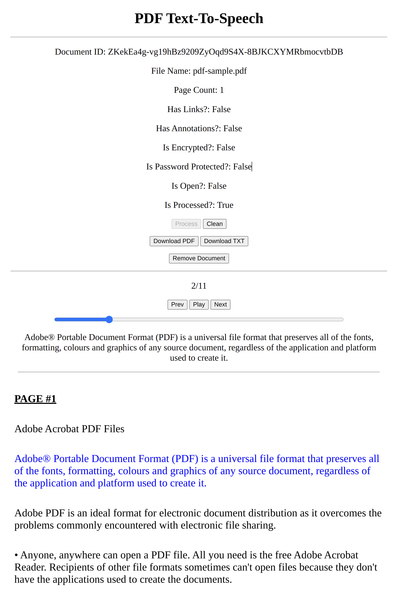

# PDF Text-To-Speech

Why just read your documents when you can also listen to them? It has been proven that is much easier for the brain to
retain information when it is presented through multiple channels (e.g. visual + auditory inputs).

Start saving precious time and energy by converting your documents to speech, and then listen to them like an audiobook
at your own pace.

## Installation
### Dependencies:

Python 3.X is required with the following modules:
- Flask (for Web Interface + API)
- PyMuPDF (for PDF Parsing functionality)
- Google Cloud Text-To-Speech API (for TTS Functionality)
- difflib (for PDF text filtering functionality [WIP])

First, install all Python dependencies with:
```bash
pip3 install -r requirements.txt
```

### Setting up Google TTS:

Next, follow the instructions here: https://cloud.google.com/text-to-speech/docs/before-you-begin

NOTE: You must have `GOOGLE_APPLICATION_CREDENTIALS` variable set in your environment for `Google TTS` to work.

For example, add the credentials file to your `~/.bashrc` or `~/.zshrc` file as follows:

```bash
export GOOGLE_APPLICATION_CREDENTIALS="$HOME/API_KEYS/XXX-XXX-XXYYZZ.json"
```

Then re-source your `~/.bashrc` (or `~/.zshrc`) file as such:

```bash
source ~/.bashrc # or ~/.zshrc
```

## Running the Web Server:

```
flask run
```

## Usage:

- Once the web server is started, navigate to http://localhost:5000/ (http://127.0.0.1:5000).
- Upload a PDF file (ex: [pdf-sample.pdf](./pdf-sample.pdf) in the root of this repository)
- Process the file by clicking the `Process` button
- Press `Prev` (or `Left Arrow` button) or `Next` (or `Right Arrow` button) to navigate through the sentences
- Press `Play` or the `Ctrl + SPACE` button to listen to the audio, automatically progressing to the next sentence
- You can also click on any sentence to navigate to it

## Interface:


